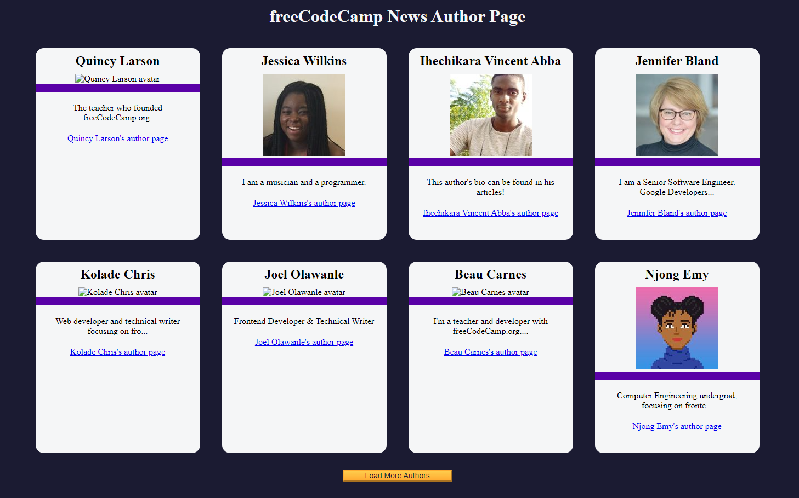

# freeCodeCamp News Author Page 📰

## DEMO:  [DEMO LInk](https://mduduzindlovu-dev.github.io/fetch-and-promises-on-fCC-Authors-Page/)

## 🚀 About This Project
This project is a dynamic web page that fetches and displays a list of authors from the freeCodeCamp News API. It was built as part of my learning journey to strengthen my skills in **JavaScript, DOM manipulation, API fetching, and responsive web design**.

## 🎯 What This Project Showcases
- **JavaScript & API Handling**: Fetching data from an API and dynamically updating the DOM.
- **DOM Manipulation**: Creating and appending elements dynamically.
- **Asynchronous JavaScript**: Handling promises with `.then()` and `.catch()`.
- **Error Handling**: Providing a user-friendly message when API calls fail.
- **Load More Functionality**: Implementing pagination-like behavior to fetch and display more authors on demand.
- **Responsive Design**: Ensuring the layout adapts to different screen sizes.

## 🛠️ Technologies Used
- **HTML** - For structuring the content.
- **CSS** - For styling and responsive design.
- **JavaScript** - For interactivity and API fetching.

## 📸 Demo Preview


## 📂 Project Structure
```
├── index.html  # Main HTML structure
├── styles.css  # Styling for the page
├── script.js   # JavaScript for fetching and displaying authors
├── README.md   # This file XD
```

## 📖 Lessons Learned
This project was an opportunity to reinforce my understanding of JavaScript and working with APIs. Some key takeaways:
- **The importance of selecting elements correctly** (yes, I originally had a query selector issue that took me a while to debug (XD)).
- **Handling large data sets efficiently** instead of dumping everything at once.
- **User experience matters!** Adding graceful error handling and a disabled button state improved usability.

## 🚀 How to Run the Project
1. Clone this repository:
   ```sh
   git clone https://github.com/MduduziNdlovu-dev/fetch-and-promises-on-fCC-Authors-Page.git
   ```
2. Open `index.html` in your browser.
3. Click "Load More Authors" to fetch additional authors dynamically.

## 🎯 Future Improvements
- Add search functionality to filter authors.
- Implement a smoother loading animation while fetching data.
- Convert to a React-based project to practice component-based architecture.

---
> **Looking for an enthusiastic developer?** I'm eager to grow and contribute to a team! Feel free to reach out. 🚀

👨‍💻 **Connect with me:**  
[LinkedIn](https://www.linkedin.com/in/mduduzi-ndlovu) | [GitHub](https://github.com/MduduziNdlovu-dev)

